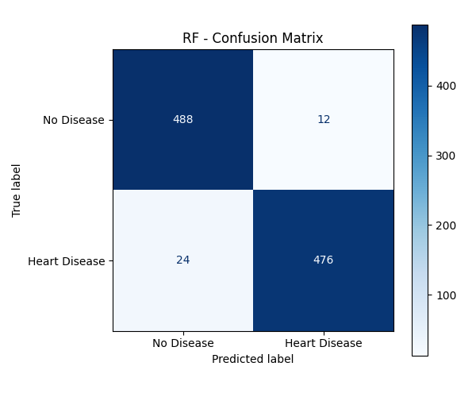
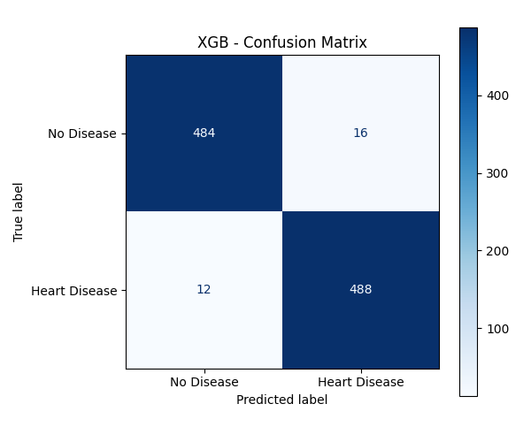

# Balanced Training Report

Summary of models trained and evaluation on the 1,000-sample test set.

| Model | Accuracy | ROC-AUC | Confusion Matrix |
|---|---:|---:|:---:|
| Logistic | 0.8760 | 0.9474 |  |
| RF | 0.9640 | 0.9946 |  |
| XGB | 0.9720 | 0.9953 |  |
| MLP | 0.9730 | 0.9932 |  |


## Detailed Classification Reports


```
=== Logistic ===
ROC-AUC: 0.9474
Accuracy: 0.8760
Classification Report:
               precision    recall  f1-score   support

   No Disease       0.88      0.87      0.88       500
Heart Disease       0.87      0.88      0.88       500

     accuracy                           0.88      1000
    macro avg       0.88      0.88      0.88      1000
 weighted avg       0.88      0.88      0.88      1000

Model params (selected):
{
  "C": 1,
  "class_weight": null,
  "dual": false,
  "fit_intercept": true,
  "intercept_scaling": 1,
  "l1_ratio": 0.0,
  "max_iter": 1000,
  "n_jobs": null,
  "penalty": "l1",
  "random_state": 42
}


=== RF ===
ROC-AUC: 0.9946
Accuracy: 0.9640
Classification Report:
               precision    recall  f1-score   support

   No Disease       0.95      0.98      0.96       500
Heart Disease       0.98      0.95      0.96       500

     accuracy                           0.96      1000
    macro avg       0.96      0.96      0.96      1000
 weighted avg       0.96      0.96      0.96      1000

Model params (selected):
{
  "bootstrap": true,
  "ccp_alpha": 0.0,
  "class_weight": null,
  "criterion": "gini",
  "max_depth": 20,
  "max_features": "sqrt",
  "max_leaf_nodes": null,
  "max_samples": null,
  "min_impurity_decrease": 0.0,
  "min_samples_leaf": 1
}


=== XGB ===
ROC-AUC: 0.9953
Accuracy: 0.9720
Classification Report:
               precision    recall  f1-score   support

   No Disease       0.98      0.97      0.97       500
Heart Disease       0.97      0.98      0.97       500

     accuracy                           0.97      1000
    macro avg       0.97      0.97      0.97      1000
 weighted avg       0.97      0.97      0.97      1000

Model params (selected):
{
  "objective": "binary:logistic",
  "base_score": null,
  "booster": null,
  "callbacks": null,
  "colsample_bylevel": null,
  "colsample_bynode": null,
  "colsample_bytree": null,
  "device": null,
  "early_stopping_rounds": null,
  "enable_categorical": true
}


=== MLP ===
ROC-AUC: 0.9932
Accuracy: 0.9730
Classification Report:
               precision    recall  f1-score   support

   No Disease       0.97      0.97      0.97       500
Heart Disease       0.97      0.97      0.97       500

     accuracy                           0.97      1000
    macro avg       0.97      0.97      0.97      1000
 weighted avg       0.97      0.97      0.97      1000

Model params (selected):
{
  "activation": "tanh",
  "alpha": 0.0001,
  "batch_size": "auto",
  "beta_1": 0.9,
  "beta_2": 0.999,
  "early_stopping": false,
  "epsilon": 1e-08,
  "hidden_layer_sizes": [
    128
  ],
  "learning_rate": "constant",
  "learning_rate_init": 0.001
}


```

